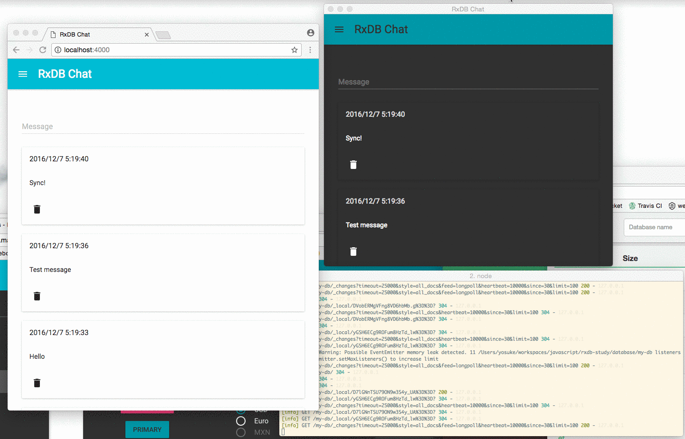

# RxDB Simple chat app

[](https://greenkeeper.io/)

This is an example repository using [RxDB](https://github.com/pubkey/rxdb) including both Web app and Electron app.


## Install

Clone this repository, and exec the following:

```sh
npm i
npm start
```

